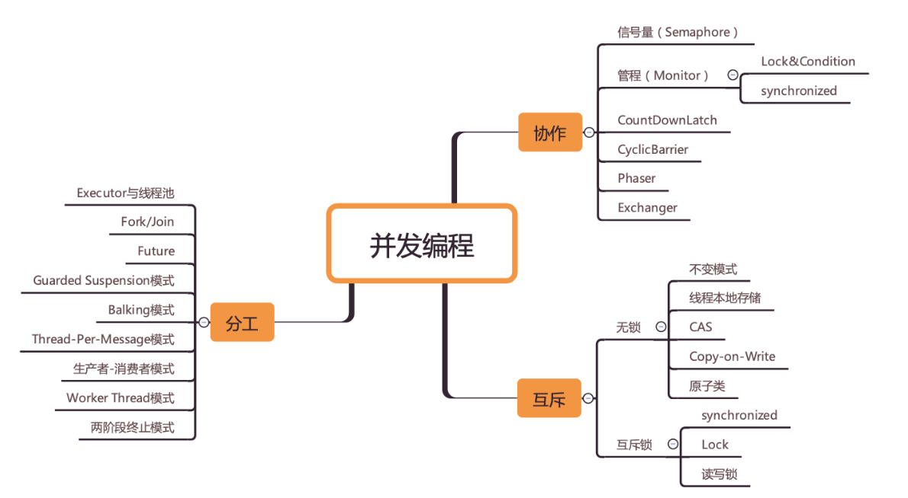

# 前言
学好并发，三条主线：
1. 分工。eg：Executor、ForkJoin、Future，生产者消费者模式，Thread-Per-Message、Worker Thread等模式。
2. 同步。线程间的协作：当一个线程执行完了一个任务，如何通知执行后续任务的线程开工。eg，比如Future的get，CountDownLatch、CyclicBarrier、Phaser、Exchanger。
3. 互斥。线程安全，并发程序中，多个线程同时访问同一个共享变量，可能有原子性、有序性、可见性的问题。核心是锁，Synchronized、Lock，ReadWriteLock、StampedLock、乐观锁、分段锁、原子类。ConcurrentHashMap、CopyOnWriteXXX、死锁。


另外，要看本质，这个概念是从哪儿来的？背景和解决的问题是什么，理论模型是什么。

## 为什么要学好并发

虽然第一要义是不要写并发程序，但是现在并发编程是一项必备技能。怎么写出正确高效的？

1. 理解技术背后的理论和模型，比如信号量模型、管程模型。涉及到操作系统、CPU、内存等多方面的知识。
2. 坚持

# 并发编程BUG的三大性

## 并发程序背后的故事

CPU、内存、IO三者之间的速度差异很大，为了平衡，做了以下事情：

1. CPU增加了**缓存**，均衡与内存的速度差异
2. 操作系统增加了**线程**、进程，用来**时分复用**CPU，均衡CPU与IO设备的速度差异
3. 编译程序**优化指令执行次序**，让缓存能够合理得到使用。

## 缓存导致的可见性问题

一个线程对共享变量的修改，另外一个线程能够马上看到，这就是可见性。

CPU缓存 和 内存中的值可能不是时刻一致的。

代码验证：见 TestVisible，每个线程先读变量到CPU缓存中，操作之后再写到内存中。

## 线程切换导致的原子性问题

时间片-多进程切换交替获得CPU的使用权 ==> 分时复用系统。

- 进程：由于不共享内存空间，如果切换就需要切换内存映射地址
- 线程：进程创建的所有线程，共享一个内存空间，切换任务成本比较低


比如一个 count+=1 的语句，底层实际是三条机器指令：变量加载到CPU寄存器、寄存器数值加一、写入内存或CPU缓存。


把一个或者多个操作，在CPU执行过程中不被中断的特性叫做原子性。CPU能保证的原子操作是CPU指令级别的，与高级语言的一条指令并不一一对应，需要注意。（注意下，在32位机器上对long double变量进行加减操作有并发隐患）

## 编译优化带来的有序性问题

```java
 private static TestSingleObject instance;

    public static TestSingleObject getInstance() {
        if (instance == null) {
            synchronized (TestSingleObject.class) {
                if (instance == null) {
                    instance = new TestSingleObject();
                }
            }
        }
        return instance;
    }
```

这个单例模式是有问题的，new操作：

1. 分配内存M
2. 内存M上初始化对象
3. M的地址赋值给变量。

第2 3 步可能因为优化导致顺序颠倒，可能导致空指针异常。


# Java内存模型

解决可见性 + 有序性。

## 什么是？

为了兼具 性能 与正确性，需要做到按需禁用缓存 和 编译优化，提供给程序员手段。具体方法包括volatile、Synchronized、final、happens-before

### volatile

禁用cpu缓存，必须从内存中读取或者写入。

### happens-before

表达了前面一个操作的结果对后续操作是可见的，约束了编译器的优化行为。

1. 程序的顺序性规则：在一个线程中，前面代码的操作happens before后面的代码操作。
2. volatile变量规则：对一个volatile变量的写操作，happens before于后续对这个volatile变量的读操作。
3. 传递性：A happens before B、B  happens before C=> A happens before C。举个例子：

- x=42 happens before v== true
- 写v==true hb 读v==true
- x == 42 hb 读变量X

4. 管程中锁的规则：对一个锁的解锁happens before于后续对这个锁的加锁。

5. 线程start规则：线程A启动子线程B后，B能看到线程A在启动子线程B前的操作。

   ```java
   Thread B = new Thread(()->{
     // 主线程调用B.start()之前
     // 所有对共享变量的修改，此处皆可见
     // 此例中，var==77
   });
   // 此处对共享变量var修改
   var = 77;
   // 主线程启动子线程
   B.start();
   ```

6. 线程join规则，A等待B执行完成，则A线程能看到线程B中的操作。

```java
Thread B = new Thread(()->{
  // 此处对共享变量var修改
  var = 66;
});
// 例如此处对共享变量修改，
// 则这个修改结果对线程B可见
// 主线程启动子线程
B.start();
B.join()
// 子线程所有对共享变量的修改
// 在主线程调用B.join()之后皆可见
// 此例中，var==66
```

### final

final就表示了这个变量生而不变，可以使劲优化。后面对final类型变量的重排进行了约束，只要构造函数没有逸出，就没有问题。

```java
// 错误的构造函数, 线程通过global.obj读取x是有可能读到0的
public FinalFieldExample() { 
  x = 3;
  y = 4;
  // 此处就是讲this逸出，
  global.obj = this;
}
```


# 互斥锁： 解决原子性问题

eg：long型变量是64位，在32位cpu上执行写操作会拆分成两次写操作。如果两个线程在不同的CPU核心中同时写long变量高32位的话，就会出现bug了：重新读出来却不是自己写出的。


原子性：一个或者多个操作在CPU执行的过程中不被中断。**本质是要保证中间状态不对外可见**。不能直接禁用线程切换，那就效率太低下了。（这种情况就是互斥，同一时刻只有一个线程执行）

## 锁模型

确定要锁定的对象，锁要保护的资源以及在哪里加锁解锁。


首先，标注临界区要保护的资源R；其次，要保护资源R就得为它创建锁LR；最后，需要在进出临界区时添加加锁操作和解锁操作。


Java中的锁：Synchronized

```java
class X {
  // 修饰非静态方法
  synchronized void foo() {
    // 临界区
  }
  // 修饰静态方法
  synchronized static void bar() {
    // 临界区
  }
  // 修饰代码块
  Object obj = new Object()；
  void baz() {
    synchronized(obj) {
      // 临界区
    }
  }
}  
```

> 修饰静态方式：锁的是当前类的Class对象；修饰非静态方法，锁的是当前实例对象this

解决count+=1的问题：根据happens-before传递性规则，前一个线程在临界区

修改的共享变量（解锁之前），对后续进入临界区（加锁之后）的线程是可见的。当然，为了保证可见性，在get方法那里也要加上锁。

```java
class SafeCalc {
  long value = 0L;
  synchronized long get() {
    return value;
  }
  synchronized void addOne() {
    value += 1;
  }
}
```


一把锁可以锁上多个受保护资源，如果并发操作用的是不同的锁，那是做不到线程安全的。

## 保护没有关联关系的多个资源

比如一个账户下的属性有 密码、账户余额。这两个属性的修改与查看可以用同一把锁，但是性能太差：取款、查看余额、修改密码、查看密码都要是串行的。 最好，是用不同的锁对受保护的资源进行精细化管理，提升性能。就是**细粒度锁**。

## 保护有关联关系的多个资源

比如账户转账

```java
class Account {
  private int balance;
  // 转账
  synchronized void transfer(Account target, int amt){
    if (this.balance > amt) {
      this.balance -= amt;
      target.balance += amt;
    }
  } 
}
```

临界区有两个资源：转出账户的余额this.balance 和 转入账户的余额target.balance。问题出在this这把锁，因为保护不了别人的余额target.balance。

比如：账户A往账户B转账，账户B往账户C转账，两个线程可以同时进入临界区，就会造成写覆盖，有一方的写入丢失了。

## 使用锁的正确姿势

要让锁能覆盖所有受保护资源，上面的例子可以这样写：(创建Account对象时，传入相同的lock，但是这种方式缺乏实践性，需要写代码的时候做好保障。)

```java
class Account {
  private Object lock；
  private int balance;
  private Account();
  // 创建Account时传入同一个lock对象
  public Account(Object lock) {
    this.lock = lock;
  } 
  // 转账
  void transfer(Account target, int amt){
    // 此处检查所有对象共享的锁
    synchronized(lock) {
      if (this.balance > amt) {
        this.balance -= amt;
        target.balance += amt;
      }
    }
  }
}
```

用类对象就好了~都是共享的

```java
class Account {
  private int balance;
  // 转账
  void transfer(Account target, int amt){
    synchronized(Account.class) {
      if (this.balance > amt) {
        this.balance -= amt;
        target.balance += amt;
      }
    }
  } 
}
```


# 死锁

上一个转账的例子，直接锁Account.class粒度太大了，性能太差了。可以这样子，A向B账户转账，拿账户A和账户B的对象锁


```java
class Account {
  private int balance;
  // 转账
  void transfer(Account target, int amt){
    // 锁定转出账户
    synchronized(this) {              
      // 锁定转入账户
      synchronized(target) {           
        if (this.balance > amt) {
          this.balance -= amt;
          target.balance += amt;
        }
      }
    }
  } 
}
```

用了这个细粒度的锁，并行度就提高了，但是可能会导致死锁。比如一个线程做的是账户A往账户B转账，另外一个线程做的是账户B往账户A转账。


死锁：一组相互竞争资源的线程因为相互等待，导致永久阻塞的现象。看一下有向的资源分配图：


## 如何预防死锁

死锁的条件：

1. 互斥，共享资源X和Y只能被一个线程占用【不能破解】
2. 占用且等待：线程获得共享资源X，在等待Y资源的时候，不释放共享资源X。【可以一次性申请所有资源】
3. 不可抢占：其他线程不能强行抢占线程占有的资源【线程申请其他资源的时候，如果申请不到，可以主动释放它占有的资源】
4. 循环等待：线程之间相互等待其他线程占有的资源。【可以按照顺序申请资源，这样就不会循环了】

### 破坏占有且等待条件

增加一个管理员，所有账户申请资源都通过管理员来申请资源，一次性申请。

Allocator（单例），Account持有Allocator的单例对象，转账时，首先向Allocator申请资源

```java
class Allocator {
  private List<Object> als =
    new ArrayList<>();
  // 一次性申请所有资源
  synchronized boolean apply(
    Object from, Object to){
    if(als.contains(from) ||
         als.contains(to)){
      return false;  
    } else {
      als.add(from);
      als.add(to);  
    }
    return true;
  }
  // 归还资源
  synchronized void free(
    Object from, Object to){
    als.remove(from);
    als.remove(to);
  }
}

class Account {
  // actr应该为单例
  private Allocator actr;
  private int balance;
  // 转账
  void transfer(Account target, int amt){
    // 一次性申请转出账户和转入账户，直到成功
    while(!actr.apply(this, target))
      ；
    try{
      // 锁定转出账户
      synchronized(this){              
        // 锁定转入账户
        synchronized(target){           
          if (this.balance > amt){
            this.balance -= amt;
            target.balance += amt;
          }
        }
      }
    } finally {
      actr.free(this, target)
    }
  } 
}
```


### 破坏不可抢占条件

synchronized不能做到，但是Lock可以做到

### 破坏循环等待条件

这里是按照账户的id顺序来申请锁

```java
class Account {
  private int id;
  private int balance;
  // 转账
  void transfer(Account target, int amt){
    Account left = this        ①
    Account right = target;    ②
    if (this.id > target.id) { ③
      left = target;           ④
      right = this;            ⑤
    }                          ⑥
    // 锁定序号小的账户
    synchronized(left){
      // 锁定序号大的账户
      synchronized(right){ 
        if (this.balance > amt){
          this.balance -= amt;
          target.balance += amt;
        }
      }
    }
  } 
}
```

# 用 等待通知 机制优化循环等待

```java
// 一次性申请转出账户和转入账户，直到成功
while(!actr.apply(this, target))
```

如果apply方法耗时长，或者并发冲突量大的时候，可能循环很久，才能获取到锁，消耗了很多CPU资源。

最好的方法：线程要求的条件不满足，那么线程阻塞自己，进入等待状态；线程要求的条件满足后，通知等待的线程重新执行。用线程阻塞的方式避免循环等待消耗CPU。


一个完整的等待-通知机制：线程首先获取互斥锁，当线程要求的条件不满足时，释放互斥锁，进入等待状态；当要求的条件满足时，通知等待的线程，重新获取互斥锁。

## synchronized实现


等待队列与互斥锁是一对一的关系，每个互斥锁有自己独立的等待队列。


wait就会让当前线程阻塞，进入右边的等待队列，同时释放持有的互斥锁，其他线程就能获得锁进入临界区。

notify、notifyAll会通知等待队列中的线程，告诉它条件曾经满足过，它就会再次尝试获取互斥锁。

这三个API都只能在synchronized块里面使用，不然会抛出java.lang.IllegalMonitorStateException。

## 一个更好地资源分配器

```java
class Allocator {
  private List<Object> als;
  // 一次性申请所有资源
  synchronized void apply(Object from, Object to){
    // 经典写法
    while(als.contains(from) ||
         als.contains(to)){ //重新判断条件是否满足
      try{
        wait();
      }catch(Exception e){
      }   
    } 
    als.add(from);
    als.add(to);  
  }
  // 归还资源
  synchronized void free(
    Object from, Object to){
    als.remove(from);
    als.remove(to);
    notifyAll();
  }
}
```

## 尽量使用notifyAll

**notify()是会随机地通知等待队列中的一个线程，而notifyAll()会通知等待队列中的所有线程**。

例子：资源A B C D。线程1申请到了AB，线程2申请到了CD，线程3此时要申请AB会进入等待队列，线程4申请CD也会进入等待队列。后面线程1归还了资源AB，如果用notify来通知等待队列中的线程，有可能被通知的是线程4，但线程4申请的是CD，还是会继续等待，而真正该唤醒的线程再也没有机会被唤醒了。

# 安全性、活跃性以及性能问题

## 安全性问题

线程安全，主要就是：原子性、可见性、有序性。在存在共享数据且该数据会发生变化时，也就是说有多个线程会同时读写同一数据时才可能会出问题。

1. 不共享数据或者数据不会变化：线程本地存储、不变模式

2. 在数据竞争的情况下，存在竞态条件：程序执行结果依赖线程执行的顺序。要靠互斥、锁等方式解决。

   ```java
   if (状态变量 满足 执行条件) { 
       执行操作
   }
   ```

   在检查完条件后执行操作时，可能其他线程修改了状态变量。

## 活跃性问题

- 死锁 ：见上节
- 活锁 【比如一直谦让，却一直没执行】，解决方式：可以等待一个随机时间，再谦让，避免谦让后碰撞。
- 饥饿：比如线程优先级很低，又比如其他拿锁的线程，执行时间很长。
  - 保证资源充足
  - 公平分配资源【比如公平锁】
  - 避免持有锁的线程长时间执行

## 性能问题

锁过度使用可能导致串行化的范围过大，性能提升不了。

1. 最好使用无锁的算法和数据结构。比如线程本地存储、写时复制、乐观锁、原子类、Disruptor则是一个无锁的内存队列，性能非常好。
2. 减少锁的持有时间，比如使用细粒度锁，ConcurrentHashMap；读写锁。

性能方面的指标：

1. 吞吐量：单位时间内能处理的请求数量。
2. 延迟：从发出请求到收到响应的时间。
3. 并发量：能同时处理的请求数量。一般来说，随着并发量的增加，延迟也会增加。


# 管程：并发编程的万能钥匙

## 什么是管程

管程和信号量是等价的，synchronized、wait、notifyAll都是管程的组成部分。管程Monitor，指的是管理共享变量以及对共享变量的操作过程，让他们支持并发。

## MESA模型

并发编程的两大核心问题：互斥【同一时刻只允许一个线程访问共享资源】和同步【线程之间如何通信、协作】。

- 互斥，比如封装一个线程不安全的队列成线程安全的队列。管程X将共享变量queue和相关的操作：enq、deq封装。线程如果想要访问queue，只能通过管程调用的enq deq。这两个方法，只允许一个线程进入管程。
- 同步：条件变量 都 对应一个等待队列。


- 线程发现竞态条件不满足，就会通过A.wait方法进入对应的等待队列等待。
- 当条件满足时，线程需要调用A.notify通知A等待队列中的线程。

```java
public class BlockedQueue{ 
    final Lock lock = new ReentrantLock();
    // 条件变量：队列不满
    final Condition notFull = lock.newCondition();
	// 条件变量：队列不空
	final Condition notEmpty = lock.newCondition();
    // 入队 
    void enq(T x) {
        lock.lock();
        try {
          while (队列已满){
            // 等待队列不满 
            notFull.await();
          }  
          // 省略入队操作...
          //入队后,通知可出队
          notEmpty.signal();
        }finally {
          lock.unlock();
        }
	} 
    // 出队 
    void deq(){
        lock.lock();
        try {
          while (队列已空){
            // 等待队列不空
            notEmpty.await();
          }
          // 省略出队操作...
          //出队后，通知可入队
          notFull.signal();
        }finally {
          lock.unlock();
        }  
	} 
}
```

await和前面wait的语义是一致的，signal和notify语义是一致的。

## wait的正确姿势

```java
while(条件不满足) {
  wait();
}
```

## notify何时可以使用

1. 所有等待线程拥有相同的等待条件；
2. 所有等待线程被唤醒后，执行相同的操作；
3. 只需要唤醒一个线程。

```java
while (阻塞队列已满){
  // 等待队列不满
  notFull.await();
}
// 省略入队操作...
// 入队后,通知可出队
notEmpty.signal();
```


# Java线程：生命周期

`jstack` 命令或者`Java VisualVM`这个可视化工具将JVM所有的线程栈信息导出来，完整的线程栈信息不仅包括线程的当前状态、调用栈，还包括了锁的信息。

## 通用的线程生命周期

1. 初始状态：线程已经被创建，不允许分配CPU运行。仅仅是在编程语言层面，OS层面上真正的线程还没有创建
2. 可运行状态：可以分配CPU运行。OS层面上线程创建了。
3. 运行状态：分配到CPU的线程的状态
4. 休眠状态：调用阻塞API 或者 等待某个事件比如条件变量，就会休眠，释放CPU使用权。
5. 终止状态：线程执行完或者异常。

Java语言里则把可运行状态和运行状态合并了，这两个状态在操作系统调度层面有用，而JVM层面不关心这两个状态，因为JVM把线程调度交给操作系统处理了。

## Java中的

1. NEW（初始化状态）
2. RUNNABLE（可运行/运行状态）
3. BLOCKED（阻塞状态）
4. WAITING（无时限等待）
5. TIMED_WAITING（有时限等待）
6. TERMINATED（终止状态）


1. Runnable<-> Blocked: 只有等待synchronized锁没有获取到。（调用阻塞API时，OS层面线程会切换到休眠【等待IO】，但是在JVM看来等待CPU 与 等待IO没有区别，都是Runnable）
2. Runnable<- >WAITING
   1. synchronized 里面的Object.wait
   2. Thread.join
   3. LockSupport.park unpark
3. Runnable<->TIMED_WAITING
   1. Thread.sleep(long)
   2. synchronized {Object.wait(long)}
   3. Thread.join(long)
   4. LockSupport.parkNanos(long)
   5. LockSupport.parkUtil(long)
4. New-> Runnable: 调用线程Thread.start
5. Runnable->TERMINATED: 
   1. 执行完或者异常
   2. stop【不要用，类似suspend和resume】
   3. interrupt 通知线程

被动：

- 当线程A处于WAITING、TIMED_WAITING状态时，如果其他线程调用线程A的interrupt()方法，会使线程A返回到RUNNABLE状态，同时线程A的代码会触发InterruptedException异常。
- 当线程A处于RUNNABLE状态时，并且阻塞在java.nio.channels.InterruptibleChannel上时，如果其他线程调用线程A的interrupt()方法，线程A会触发java.nio.channels.ClosedByInterruptException这个异常
- 阻塞在java.nio.channels.Selector上时，如果其他线程调用线程A的interrupt()方法，线程A的java.nio.channels.Selector会立即返回

主动：

- 线程可以自己通过isInterrupted方法，检测自己是不是被中断了。

# 创建多少线程才是合适的

“各种线程池的线程数量调整成多少是合适的？”或者“Tomcat的线程数、Jdbc连接池的连接数是多少？”

## 为什么要使用多线程

两个指标：延迟和吞吐量。希望降低延迟，提高吞吐量。

优化思路：优化算法、将硬件的性能发挥到极致，也就是CPU和IO的利用率。

- 操作系统：利用中断机制 避免CPU轮询IO，提升了CPU的使用率。
- 程序，多线程。


假设程序按照CPU计算和I/O操作交叉执行的方式运行，而且CPU计算和I/O操作的耗时是1:1。

- 如果只有一个线程，执行CPU计算的时候，I/O设备空闲；执行I/O操作的时候，CPU空闲，所以CPU的利用率和I/O设备的利用率都是50%
- 如果有两个线程，当线程A执行CPU计算的时候，线程B执行I/O操作；当线程A执行I/O操作的时候，线程B执行CPU计算，这样CPU的利用率和I/O设备的利用率就都达到了100%。

在单核时代，多线程就是用来平衡CPU和IO设备的，如果程序只有CPU计算，而没有I/O操作的话，多线程不但不会提升性能，还会使性能变得更差，原因是增加了线程切换的成本。在多核时代，这种纯计算型的程序也可以利用多线程来提升性能。


计算1+2+… … +100亿的值，如果在4核的CPU上利用4个线程执行，线程A计算[1，25亿)，线程B计算[25亿，50亿)，线程C计算[50，75亿)，线程D计算[75亿，100亿]，之后汇总，那么理论上应该比一个线程计算[1，100亿]快将近4倍，响应时间能够降到25%。一个线程，对于4核的CPU，CPU的利用率只有25%，而4个线程，则能够将CPU的利用率提高到100%。

## 创建多少线程合适?

大部分情况下，I/O操作执行的时间相对于CPU计算来说都非常长，这种场景我们一般都称为I/O密集型计算；和I/O密集型计算相对的就是CPU密集型计算了，CPU密集型计算大部分场景下都是纯CPU计算。

1. CPU密集计算，多线程本质是提升多核CPU利用率；为了避免增加线程切换的成本呢 和考虑到 因为偶尔的内存页失效或者其他原因阻塞，一般线程数量=CPU核数+1
2. IO密集型计算，最佳的线程数是与程序中CPU计算和I/O操作的耗时比相关的。最佳线程数=1 +（I/O耗时 / CPU耗时）：当线程A执行IO操作时，另外R个线程正好执行完各自的CPU计算。这样CPU的利用率就达到了100%。 如果是多核CPU，最佳线程数=CPU核数 * [ 1 +（I/O耗时 / CPU耗时）]


> 假设一个 I/O 密集型任务中，每次 I/O 操作需要 100 毫秒（I/O 耗时），而每次 CPU 处理数据的时间只需要 10 毫秒（CPU 耗时）。根据公式：
> 最佳线程数 = 1 +（100 / 10） = 1 + 10 = 11
>
> 
>
> 这意味着在这个场景中，为了充分利用 CPU 资源，提高程序的整体性能，理想情况下应该创建 11 个线程。其中 1 个线程负责处理 CPU 相关的任务，另外 10 个线程用于在 I/O 操作等待期间执行其他任务，从而使得 CPU 在大部分时间都处于忙碌状态，提高了系统的并发处理能力和资源利用率。

# 为什么局部变量是线程安全的

## 方法是如何执行的

```
int a = 7；
int[] b = fibonacci(a);
int[] c = b;
```

调用fibonacci(a)的时候，CPU要先找到方法 fibonacci() 的地址，然后跳转到这个地址去执行代码，最后CPU执行完方法 fibonacci() 之后，要能够返回。首先找到调用方法的下一条语句的地址：也就是`int[] c=b;`的地址，再跳转到这个地址去执行


CPU怎么找调用方法的参数和返回值？堆栈寄存器，调用栈。


每个方法在调用栈里面有自己的独立空间：栈帧，里面有方法需要的参数和返回地址。调用方法时，就会创建新的栈帧，压入调用栈；方法返回时，栈帧就弹出。

## 局部变量存哪里

局部变量的作用域是方法内部，**局部变量就是放到了调用栈里**。


局部变量是和方法同生共死的，一个变量如果想跨越方法的边界，就必须创建在堆里。

## 调用栈与线程

两个线程可以同时用不同的参数调用相同的方法，那调用栈和线程之间是什么关系呢？答案是：**每个线程都有自己独立的调用栈**。因为如果不是这样，那两个线程就互相干扰了。


因为每个线程都有自己的调用栈，局部变量保存在线程各自的调用栈里面，不会共享，所以自然也就没有并发问题。

## 线程封闭

方法里面的局部变量，因为不会和其他线程共享，所以没有并发问题。这个思路就叫做线程封闭：仅在单线程内访问数据，不存在共享，无并发问题。


例如从数据库连接池里获取的连接Connection，在JDBC规范里并没有要求这个Connection必须是线程安全的。数据库连接池通过线程封闭技术，保证一个Connection一旦被一个线程获取之后，在这个线程关闭Connection之前的这段时间里，不会再分配给其他线程，从而保证了Connection不会有并发问题。

# 如何利用面向对象思想写好并发程序

## 1. 如何封装共享变量

面向对象思想里面有一个很重要的特性是**封装**，封装的通俗解释就是**将属性和实现细节封装在对象内部**，外界对象**只能通过**目标对象提供的**公共方法来间接访问**这些内部属性。

我们把共享变量作为对象的属性，那对于共享变量的访问路径就是对象的公共方法，这里可以做并发访问策略。利用面向对象思想写并发程序的思路，其实就这么简单：**将共享变量作为对象属性封装在内部，对所有公共方法制定并发访问策略**。【注意逸出】

```
public class Counter {
  private long value;
  synchronized long get(){
    return value;
  }
  synchronized long addOne(){
    return ++value;
  }
}
```

信用卡账户有卡号、姓名、身份证、信用额度、已出账单、未出账单等很多共享变量。很多共享变量的值是不会变的，例如信用卡账户的卡号、姓名、身份证。**对于这些不会发生变化的共享变量，建议你用final关键字来修饰**。这样既能避免并发问题，也能很明了地表明你的设计意图.

## 2. 识别共享变量之间的约束条件

识别共享变量间的约束条件非常重要。因为**这些约束条件，决定了并发访问策略**。例如，库存管理里面有个合理库存的概念，库存量不能太高，也不能太低，它有一个上限和一个下限。

```java
public class SafeWM {
  // 库存上限
  private final AtomicLong upper =
        new AtomicLong(0); // 原子类不需要同步。
  // 库存下限
  private final AtomicLong lower =
        new AtomicLong(0);
  // 设置库存上限
  void setUpper(long v){
    upper.set(v);
  }
  // 设置库存下限
  void setLower(long v){
    lower.set(v);
  }
  // 省略其他业务代码
}
```

约束条件: 错误的写法，竞态条件，判断过后可能就不满足条件了。

```java
// 设置库存上限
  void setUpper(long v){
    // 检查参数合法性
    if (v < lower.get()) {
      throw new IllegalArgumentException();
    }
    upper.set(v);
  }
  // 设置库存下限
  void setLower(long v){
    // 检查参数合法性
    if (v > upper.get()) {
      throw new IllegalArgumentException();
    }
    lower.set(v);
  }
```

在设计阶段，我们**一定要识别出所有共享变量之间的约束条件**

## 3. 指定并发访问策略

1. 避免共享：避免共享的技术主要是利于线程本地存储以及为每个任务分配独立的线程。
2. 不变模式：这个在Java领域应用的很少，但在其他领域却有着广泛的应用，例如Actor模式、CSP模式以及函数式编程的基础都是不变模式。
3. 管程及其他同步工具：Java领域万能的解决方案是管程，但是对于很多特定场景，使用Java并发包提供的读写锁、并发容器等同步工具会更好。


原则：

- 优先使用成熟的工具类：Java SDK并发包里提供了丰富的工具类
- 迫不得已时才使用低级的同步原语：低级的同步原语主要指的是synchronized、Lock、Semaphore等
- 避免过早优化：安全第一，并发程序首先要保证安全，出现性能瓶颈后再优化

# 总结课（1）


**锁，应是私有的、不可变的、不可重用的**。

Integer String因为可能是被重用的，可能锁被其他代码使用，可能拿不到锁。

```java
class Account {
  // 账户余额  
  private Integer balance;
  // 账户密码
  private String password;
  // 取款
  void withdraw(Integer amt) {
    synchronized(balance) {
      if (this.balance > amt){
        this.balance -= amt;
      }
    }
  } 
  // 更改密码
  void updatePassword(String pw){
    synchronized(password) {
      this.password = pw;
    }
  } 
}
```


最佳实践

```java
// 普通对象锁
private final Object 
  lock = new Object();
// 静态对象锁
private static final Object
  lock = new Object(); 
```

方法的调用，是先计算参数，然后将参数压入调用栈之后才会执行方法体.

这有个额外的知识点：

```java
logger.debug("The var1：" + 
  var1 + ", var2:" + var2); // info级别日志打印的时候，仍然会计算参数

logger.debug("The var1：{}, var2:{}", 
  var1, var2); // 仅仅是参数压栈，并不会计算。
```

中断标识可能会自动清除：

```java
Thread th = Thread.currentThread();
while(true) {
  if(th.isInterrupted()) {
    break;
  }
  // 省略业务代码无数
  try {
    Thread.sleep(100);
  }catch (InterruptedException e){
    e.printStackTrace();
      // 重新设置中断标志位
  th.interrupt();
  }
}
```

# Lock 和Condition

## 为什么还有个Lock

破坏不可抢占条件的话，synchronized做不到。我们希望做到：

> 对于“不可抢占”这个条件，占用部分资源的线程进一步申请其他资源时，如果申请不到，可以主动释放它占有的资源，这样不可抢占这个条件就破坏掉了。


1. 能响应中断：阻塞中的线程希望能被唤醒，释放它之前占有的锁
2. 支持超时：线程一段时间没有获取到锁，不是进入阻塞态而是返回错误，能释放之前锁
3. 非阻塞地获取锁：获取锁不到，不被阻塞，可以释放之前的锁。

```java
// 支持中断的API
void lockInterruptibly() 
  throws InterruptedException;
// 支持超时的API
boolean tryLock(long time, TimeUnit unit) 
  throws InterruptedException;
// 支持非阻塞获取锁的API
boolean tryLock();
```

## 如何保证可见性

```java
class X {
  private final Lock rtl =
  new ReentrantLock();
  int value;
  public void addOne() {
    // 获取锁
    rtl.lock();  
    try {
      value+=1;
    } finally {
      // 保证锁能释放
      rtl.unlock();
    }
  }
}
```

Java SDK里面的ReentrantLock，内部持有一个volatile 的成员变量state，获取锁的时候，会读写state的值；解锁的时候，也会读写state的值。也就是说，在执行value+=1之前，程序先读写了一次volatile变量state，在执行value+=1之后，又读写了一次volatile变量state。根据相关的Happens-Before规则：

```java
// 省略代码无数
state = 1;
} // 解锁 unlock() {

// 省略代码无数
state = 0;
} }
```


1. **顺序性规则**：对于线程T1，value+=1 Happens-Before 释放锁的操作unlock()；

2. **volatile变量规则**：由于state = 1会先读取state，所以线程T1的unlock()操作Happens-Before线程T2的lock()操作；

3. **传递性规则**：线程 T1的value+=1 Happens-Before 线程 T2 的 lock() 操作。

   class SampleLock { volatile int state; // 加锁 lock() {

## 什么是可重入锁？

一个线程获取到锁之后，如果想再获取一下锁，能顺利获取就是可重入锁。

可重入函数，指的是多个线程可以同时调用该函数，并且支持线程切换，每个线程都能得到正确的结果。（必定是线程安全的）

## 公平锁与非公平锁

```java
//无参构造函数：默认非公平锁
public ReentrantLock() {
    sync = new NonfairSync();
}
//根据公平策略参数创建锁
public ReentrantLock(boolean fair){
    sync = fair ? new FairSync() 
                : new NonfairSync();
}
```

入口等待队列，锁都对应着一个等待队列，如果一个线程没有获得锁，就会进入等待队列，当有线程释放锁的时候，就需要从等待队列中唤醒一个等待的线程。如果是公平锁，唤醒的策略就是谁等待的时间长，就唤醒谁，很公平；如果是非公平锁，则不提供这个公平保证，有可能等待时间短的线程反而先被唤醒。

## 用锁的最佳实践

1. 永远只在更新对象的成员变量时加锁
2. 永远只在访问可变的成员变量时加锁
3. 永远不在调用其他对象的方法时加锁

关于第三条，调用其他对象的方法，实在是太不安全了，也许“其他”方法里面有线程sleep()的调用，也可能会有奇慢无比的I/O操作，这些都会严重影响性能。更可怕的是，“其他”类的方法可能也会加锁，然后双重加锁就可能导致死锁


减少锁的持有时间、减小锁的粒度.

# Dubbo如何利用管程实现异步转同步

Condition能支持多个条件变量

## 利用两个条件变量实现阻塞队列

```
public class BlockedQueue<T>{
  final Lock lock =
    new ReentrantLock();
  // 条件变量：队列不满  
  final Condition notFull =
    lock.newCondition();
  // 条件变量：队列不空  
  final Condition notEmpty =
    lock.newCondition();

  // 入队
  void enq(T x) {
    lock.lock();
    try {
      while (队列已满){
        // 等待队列不满
        notFull.await();
      }  
      // 省略入队操作...
      //入队后,通知可出队
      notEmpty.signal();
    }finally {
      lock.unlock();
    }
  }
  // 出队
  void deq(){
    lock.lock();
    try {
      while (队列已空){
        // 等待队列不空
        notEmpty.await();
      }  
      // 省略出队操作...
      //出队后，通知可入队
      notFull.signal();
    }finally {
      lock.unlock();
    }  
  }
}
```

## 同步和异步

**调用方是否需要等待结果，如果需要等待结果，就是同步；如果不需要等待结果，就是异步**。

1. 调用方创建一个子线程，在子线程中执行方法调用，这种调用我们称为异步调用；
2. 方法实现的时候，创建一个新的线程执行主要逻辑，主线程直接return，这种方法我们一般称为异步方法。

## Dubbo

异步的场景还是挺多的，比如TCP协议本身就是异步的，我们工作中经常用到的RPC调用，**在TCP协议层面，发送完RPC请求后，线程是不会等待RPC的响应结果的**。

Dubbo帮我们做了异步转同步的动作

```java
DemoService service = 初始化部分省略
String message = 
  service.sayHello("dubbo");
System.out.println(message);
```

调用线程阻塞了，线程状态是TIMED_WAITING。本来发送请求是异步的，但是调用线程却阻塞了，说明Dubbo帮我们做了异步转同步的事情。通过调用栈，你能看到线程是阻塞在DefaultFuture.get()方法上


```java
public class DubboInvoker{
  Result doInvoke(Invocation inv){
    // 下面这行就是源码中108行
    // 为了便于展示，做了修改
    return currentClient 
      .request(inv, timeout)
      .get();
  }
}
```

需求：当RPC返回结果之前，阻塞调用线程，让调用线程等待；当RPC返回结果后，唤醒调用线程，让调用线程重新执行。

```java
// 创建锁与条件变量
private final Lock lock 
    = new ReentrantLock();
private final Condition done 
    = lock.newCondition();

// 调用方通过该方法等待结果
Object get(int timeout){
  long start = System.nanoTime();
  lock.lock();
  try {
	while (!isDone()) {
	  done.await(timeout);
      long cur=System.nanoTime();
	  if (isDone() || 
          cur-start > timeout){
	    break;
	  }
	}
  } finally {
	lock.unlock();
  }
  if (!isDone()) {
	throw new TimeoutException();
  }
  return returnFromResponse();
}
// RPC结果是否已经返回
boolean isDone() {
  return response != null;
}
// RPC结果返回时调用该方法   
private void doReceived(Response res) {
  lock.lock();
  try {
    response = res;
    if (done != null) {
      done.signal();
    }
  } finally {
    lock.unlock();
  }
}
```

调用lock()获取锁，在finally里面调用unlock()释放锁；获取锁后，通过经典的在循环中调用await()方法来实现等待。

当RPC结果返回时，会调用doReceived()方法，这个方法里面，调用lock()获取锁，在finally里面调用unlock()释放锁，获取锁后通过调用signal()来通知调用线程，结果已经返回，不用继续等待了。

例如创建云主机，就是一个异步的API，调用虽然成功了，但是云主机并没有创建成功，你需要调用另外一个API去轮询云主机的状态。如果你需要在项目内部封装创建云主机的API，你也会面临异步转同步的问题，因为同步的API更易用。


# Semaphore：实现一个限流器

## 信号量模型


- init()：设置计数器的初始值。
- down()：计数器的值减1；如果此时计数器的值小于0，则当前线程将被阻塞，否则当前线程可以继续执行。
- up()：计数器的值加1；如果此时计数器的值小于或者等于0，则唤醒等待队列中的一个线程，并将其从等待队列中移除。

init()、down()和up()三个方法都是原子性的，并且这个原子性是由信号量模型的实现方保证的

```java
class Semaphore{
  // 计数器
  int count;
  // 等待队列
  Queue queue;
  // 初始化操作
  Semaphore(int c){
    this.count=c;
  }
  // 
  void down(){
    this.count--;
    if(this.count<0){
      //将当前线程插入等待队列
      //阻塞当前线程
    }
  }
  void up(){
    this.count++;
    if(this.count<=0) {
      //移除等待队列中的某个线程T
      //唤醒线程T
    }
  }
}
```

down()、up()这两个操作历史上最早称为P操作和V操作，所以信号量模型也被称为PV原语。

## 如何使用信号量

只需要在进入临界区之前执行一下down()操作，退出临界区之前执行一下up()操作就可以了。下面是Java代码的示例，acquire()就是信号量里的down()操作，release()就是信号量里的up()操作

```java
static int count;
//初始化信号量
static final Semaphore s 
    = new Semaphore(1);
//用信号量保证互斥    
static void addOne() {
  s.acquire();
  try {
    count+=1;
  } finally {
    s.release();
  }
}
```

假设两个线程T1和T2同时访问addOne()方法，当它们同时调用acquire()的时候，由于acquire()是一个原子操作，所以只能有一个线程（假设T1）把信号量里的计数器减为0，另外一个线程（T2）则是将计数器减为-1。对于线程T1，信号量里面的计数器的值是0，大于等于0，所以线程T1会继续执行；对于线程T2，信号量里面的计数器的值是-1，小于0，按照信号量模型里对down()操作的描述，线程T2将被阻塞。所以此时只有线程T1会进入临界区执行`count+=1；`


当线程T1执行release()操作，也就是up()操作的时候，信号量里计数器的值是-1，加1之后的值是0，小于等于0，按照信号量模型里对up()操作的描述，此时等待队列中的T2将会被唤醒。于是T2在T1执行完临界区代码之后才获得了进入临界区执行的机会，从而保证了互斥性。

## 快速实现一个限流器

Semaphore还有一个功能是Lock不容易实现的，那就是：**Semaphore可以允许多个线程访问一个临界区**。


比较常见的需求就是我们工作中遇到的各种池化资源，例如连接池、对象池、线程池等等。其中，你可能最熟悉数据库连接池，在同一时刻，一定是允许多个线程同时使用连接池的，当然，每个连接在被释放前，是不允许其他线程使用的。


如果我们把计数器的值设置成对象池里对象的个数N，就能完美解决对象池的限流问题了

```java
class ObjPool<T, R> {
  final List<T> pool;
  // 用信号量实现限流器
  final Semaphore sem;
  // 构造函数
  ObjPool(int size, T t){
    pool = new Vector<T>(){};
    for(int i=0; i<size; i++){
      pool.add(t);
    }
    sem = new Semaphore(size);
  }
  // 利用对象池的对象，调用func
  R exec(Function<T,R> func) {
    T t = null;
    sem.acquire();
    try {
      t = pool.remove(0);
      return func.apply(t);
    } finally {
      pool.add(t);
      sem.release();
    }
  }
}
// 创建对象池
ObjPool<Long, String> pool = 
  new ObjPool<Long, String>(10, 2);
// 通过对象池获取t，之后执行  
pool.exec(t -> {
    System.out.println(t);
    return t.toString();
});
```

用一个List来保存对象实例，用Semaphore实现限流器。关键的代码是ObjPool里面的exec()方法，这个方法里面实现了限流的功能。在这个方法里面，我们首先调用acquire()方法（与之匹配的是在finally里面调用release()方法），假设对象池的大小是10，信号量的计数器初始化为10，那么前10个线程调用acquire()方法，都能继续执行，相当于通过了信号灯，而其他线程则会阻塞在acquire()方法上。


对于通过信号灯的线程，我们为每个线程分配了一个对象 t（这个分配工作是通过pool.remove(0)实现的），分配完之后会执行一个回调函数func，而函数的参数正是前面分配的对象 t ；


执行完回调函数之后，它们就会释放对象（这个释放工作是通过pool.add(t)实现的），同时调用release()方法来更新信号量的计数器。如果此时信号量里计数器的值小于等于0，那么说明有线程在等待，此时会自动唤醒等待的线程

# ReadWriteLock：构建缓存

这样一个场景：读多写少，缓存。

```java
class Cache<K,V> {
  final Map<K, V> m =
    new HashMap<>();
  final ReadWriteLock rwl =
    new ReentrantReadWriteLock();
  // 读锁
  final Lock r = rwl.readLock();
  // 写锁
  final Lock w = rwl.writeLock();
  // 读缓存
  V get(K key) {
    r.lock();
    try { return m.get(key); }
    finally { r.unlock(); }
  }
  // 写缓存
  V put(K key, V value) {
    w.lock();
    try { return m.put(key, v); }
    finally { w.unlock(); }
  }
}
```

**使用缓存首先要解决缓存数据的初始化问题**。缓存数据的初始化，可以采用一次性加载的方式，也可以使用按需加载的方式


如果源头数据量非常大，那么就需要按需加载了，按需加载也叫懒加载，指的是只有当应用查询缓存，并且数据不在缓存里的时候，才触发加载源头相关数据进缓存的操作

## 缓存的按需加载

```java
class Cache<K,V> {
  final Map<K, V> m =
    new HashMap<>();
  final ReadWriteLock rwl = 
    new ReentrantReadWriteLock();
  final Lock r = rwl.readLock();
  final Lock w = rwl.writeLock();

  V get(K key) {
    V v = null;
    //读缓存
    r.lock();         ①
    try {
      v = m.get(key); ②
    } finally{
      r.unlock();     ③
    }
    //缓存中存在，返回
    if(v != null) {   ④
      return v;
    }  
    //缓存中不存在，查询数据库
    w.lock();         ⑤
    try {
      //再次验证
      //其他线程可能已经查询过数据库
      v = m.get(key); ⑥
      if(v == null){  ⑦
        //查询数据库
        v=省略代码无数
        m.put(key, v);
      }
    } finally{
      w.unlock();
    }
    return v; 
  }
}
```

在高并发的场景下，有可能会有多线程竞争写锁。假设缓存是空的，没有缓存任何东西，如果此时有三个线程T1、T2和T3同时调用get()方法，并且参数key也是相同的。那么它们会同时执行到代码⑤处，但此时只有一个线程能够获得写锁，假设是线程T1，线程T1获取写锁之后查询数据库并更新缓存，最终释放写锁。


此时线程T2和T3会再有一个线程能够获取写锁，假设是T2，如果不采用再次验证的方式，此时T2会再次查询数据库。T2释放写锁之后，T3也会再次查询一次数据库。而实际上线程T1已经把缓存的值设置好了，T2、T3完全没有必要再次查询数据库。所以，再次验证的方式，能够避免高并发场景下重复查询数据的问题


## 读写锁的升级与降级

```java
//读缓存
r.lock();         ①
try {
  v = m.get(key); ②
  if (v == null) {
    w.lock();
    try {
      //再次验证并更新缓存
      //省略详细代码
    } finally{
      w.unlock();
    }
  }
} finally{
  r.unlock();     ③
}
```

ReadWriteLock并不支持这种升级。在上面的代码示例中，读锁还没有释放，此时获取写锁，会导致写锁永久等待，最终导致相关线程都被阻塞，永远也没有机会被唤醒。锁的升级是不允许的.

锁的降级却是允许的

```java
class CachedData {
  Object data;
  volatile boolean cacheValid;
  final ReadWriteLock rwl =
    new ReentrantReadWriteLock();
  // 读锁  
  final Lock r = rwl.readLock();
  //写锁
  final Lock w = rwl.writeLock();

  void processCachedData() {
    // 获取读锁
    r.lock();
    if (!cacheValid) {
      // 释放读锁，因为不允许读锁的升级
      r.unlock();
      // 获取写锁
      w.lock();
      try {
        // 再次检查状态  
        if (!cacheValid) {
          data = ...
          cacheValid = true;
        }
        // 释放写锁前，降级为读锁
        // 降级是可以的
        r.lock(); ①
      } finally {
        // 释放写锁
        w.unlock(); 
      }
    }
    // 此处仍然持有读锁
    try {use(data);} 
    finally {r.unlock();}
  }
}
```

数据同步指的是保证缓存数据和源头数据的一致性。解决数据同步问题的一个最简单的方案就是**超时机制**。所谓超时机制指的是加载进缓存的数据不是长久有效的，而是有时效的，当缓存的数据超过时效，也就是超时之后，这条数据在缓存中就失效了。而访问缓存中失效的数据，会触发缓存重新从源头把数据加载进缓存。

当然也可以在源头数据发生变化时，快速反馈给缓存，但这个就要依赖具体的场景了。例如MySQL作为数据源头，可以通过近实时地解析binlog来识别数据是否发生了变化，如果发生了变化就将最新的数据推送给缓存。另外，还有一些方案采取的是数据库和缓存的双写方案。

# StampedLock

## 支持的三种模式

**写锁**、**悲观读锁**和**乐观读**。StampedLock里的写锁和悲观读锁加锁成功之后，都会返回一个stamp；然后解锁的时候，需要传入这个stamp。

```java
final StampedLock sl = 
  new StampedLock();

// 获取/释放悲观读锁示意代码
long stamp = sl.readLock();
try {
  //省略业务相关代码
} finally {
  sl.unlockRead(stamp);
}

// 获取/释放写锁示意代码
long stamp = sl.writeLock();
try {
  //省略业务相关代码
} finally {
  sl.unlockWrite(stamp);
}
```

ReadWriteLock支持多个线程同时读，但是当多个线程同时读的时候，所有的写操作会被阻塞；而StampedLock提供的乐观读，是允许一个线程获取写锁的，也就是说不是所有的写操作都被阻塞。

**乐观读这个操作是无锁的**，所以相比较ReadWriteLock的读锁，乐观读的性能更好一些。

tryOptimisticRead()是无锁的，所以共享变量x和y读入方法局部变量时，x和y有可能被其他线程修改了。因此最后读完之后，还需要再次验证一下是否存在写操作，这个验证操作是通过调用validate(stamp)来实现的。

```java
class Point {
  private int x, y;
  final StampedLock sl = 
    new StampedLock();
  //计算到原点的距离  
  int distanceFromOrigin() {
    // 乐观读
    long stamp = 
      sl.tryOptimisticRead();
    // 读入局部变量，
    // 读的过程数据可能被修改
    int curX = x, curY = y;
    //判断执行读操作期间，
    //是否存在写操作，如果存在，
    //则sl.validate返回false
    if (!sl.validate(stamp)){
      // 升级为悲观读锁
      stamp = sl.readLock();
      try {
        curX = x;
        curY = y;
      } finally {
        //释放悲观读锁
        sl.unlockRead(stamp);
      }
    }
    return Math.sqrt(
      curX * curX + curY * curY);
  }
}
```

如果执行乐观读操作的期间，存在写操作，会把乐观读升级为悲观读锁。这个做法挺合理的，否则你就需要在一个循环里反复执行乐观读，直到执行乐观读操作的期间没有写操作（只有这样才能保证x和y的正确性和一致性），而循环读会浪费大量的CPU。升级为悲观读锁，代码简练且不易出错，建议你在具体实践时也采用这样的方法。

## 理解乐观锁

在ERP的生产模块里，会有多个人通过ERP系统提供的UI同时修改同一条生产订单，那如何保证生产订单数据是并发安全的呢？


在生产订单的表 product_doc 里增加了一个数值型版本号字段 version，每次更新product_doc这个表的时候，都将 version 字段加1。生产订单的UI在展示的时候，需要查询数据库，此时将这个 version 字段和其他业务字段一起返回给生产订单UI。假设用户查询的生产订单的id=777，那么SQL语句类似下面这样：

```sql
select id，... ，version
from product_doc
where id=777
```


用户在生产订单UI执行保存操作的时候，后台利用下面的SQL语句更新生产订单，此处我们假设该条生产订单的 version=9。

```sql
update product_doc 
set version=version+1，...
where id=777 and version=9
```

如果这条SQL语句执行成功并且返回的条数等于1，那么说明从生产订单UI执行查询操作到执行保存操作期间，没有其他人修改过这条数据。因为如果这期间其他人修改过这条数据，那么版本号字段一定会大于9。


数据库里的乐观锁，查询的时候需要把 version 字段查出来，更新的时候要利用 version 字段做验证。这个 version 字段就类似于StampedLock里面的stamp。

## StampedLock使用注意事项

对于读多写少的场景StampedLock性能很好，简单的应用场景基本上可以替代ReadWriteLock，但是**StampedLock的功能仅仅是ReadWriteLock的子集**

1. **StampedLock不支持重入**
2. 如果线程阻塞在StampedLock的readLock()或者writeLock()上时，此时调用该阻塞线程的interrupt()方法，会导致CPU飙升。例如下面的代码中，线程T1获取写锁之后将自己阻塞，线程T2尝试获取悲观读锁，也会阻塞；如果此时调用线程T2的interrupt()方法来中断线程T2的话，你会发现线程T2所在CPU会飙升到100%。

```java
final StampedLock lock
  = new StampedLock();
Thread T1 = new Thread(()->{
  // 获取写锁
  lock.writeLock();
  // 永远阻塞在此处，不释放写锁
  LockSupport.park();
});
T1.start();
// 保证T1获取写锁
Thread.sleep(100);
Thread T2 = new Thread(()->
  //阻塞在悲观读锁
  lock.readLock()
);
T2.start();
// 保证T2阻塞在读锁
Thread.sleep(100);
//中断线程T2
//会导致线程T2所在CPU飙升
T2.interrupt();
T2.join();
```

**使用StampedLock一定不要调用中断操作，如果需要支持中断功能，一定使用可中断的悲观读锁readLockInterruptibly()和写锁writeLockInterruptibly()**。

## 最佳实践

```java
final StampedLock sl = 
  new StampedLock();

// 乐观读
long stamp = 
  sl.tryOptimisticRead();
// 读入方法局部变量
......
// 校验stamp
if (!sl.validate(stamp)){
  // 升级为悲观读锁
  stamp = sl.readLock();
  try {
    // 读入方法局部变量
    .....
  } finally {
    //释放悲观读锁
    sl.unlockRead(stamp);
  }
}
//使用方法局部变量执行业务操作
......
    
long stamp = sl.writeLock();
try {
  // 写共享变量
  ......
} finally {
  sl.unlockWrite(stamp);
}
```

StampedLock支持锁的降级（通过tryConvertToReadLock()方法实现）和升级（通过tryConvertToWriteLock()方法实现），但是建议你要慎重使用

# CountDownLatch 和 CyclicBarrier：多线程步调一致

## 需求描述

对账


```java
while(存在未对账订单){
  // 查询未对账订单
  pos = getPOrders();
  // 查询派送单
  dos = getDOrders();
  // 执行对账操作
  diff = check(pos, dos);
  // 差异写入差异库
  save(diff);
} 
```

## 利用并行优化

查询未对账订单getPOrders()和查询派送单getDOrders()相对较慢


查询未对账订单getPOrders()和查询派送单getDOrders()可以并行处理


创建了两个线程T1和T2，并行执行查询未对账订单getPOrders()和查询派送单getDOrders()这两个操作。在主线程中执行对账操作check()和差异写入save()两个操作。不过需要注意的是：主线程需要等待线程T1和T2执行完才能执行check()和save()这两个操作，为此我们通过调用T1.join()和T2.join()来实现等待，当T1和T2线程退出时，调用T1.join()和T2.join()的主线程就会从阻塞态被唤醒，从而执行之后的check()和save()

```java
while(存在未对账订单){
  // 查询未对账订单
  Thread T1 = new Thread(()->{
    pos = getPOrders();
  });
  T1.start();
  // 查询派送单
  Thread T2 = new Thread(()->{
    dos = getDOrders();
  });
  T2.start();
  // 等待T1、T2结束
  T1.join();
  T2.join();
  // 执行对账操作
  diff = check(pos, dos);
  // 差异写入差异库
  save(diff);
} 
```

## CountDownLatch优化

避免重复创建线程：线程池。前面主线程通过调用线程T1和T2的join()方法来等待线程T1和T2退出，但是在线程池的方案里，线程根本就不会退出，所以join()方法已经失效了。

```java
// 创建2个线程的线程池
Executor executor = 
  Executors.newFixedThreadPool(2);
while(存在未对账订单){
  // 查询未对账订单
  executor.execute(()-> {
    pos = getPOrders();
  });
  // 查询派送单
  executor.execute(()-> {
    dos = getDOrders();
  });

  /* ？？如何实现等待？？*/

  // 执行对账操作
  diff = check(pos, dos);
  // 差异写入差异库
  save(diff);
}   
```

弄一个计数器，初始值设置成2，当执行完`pos = getPOrders();`这个操作之后将计数器减1，执行完`dos = getDOrders();`之后也将计数器减1，在主线程里，等待计数器等于0；当计数器等于0时，说明这两个查询操作执行完了。等待计数器等于0其实就是一个条件变量，用管程实现起来也很简单。

```java
// 创建2个线程的线程池
Executor executor = 
  Executors.newFixedThreadPool(2);
while(存在未对账订单){
  // 计数器初始化为2
  CountDownLatch latch = 
    new CountDownLatch(2);
  // 查询未对账订单
  executor.execute(()-> {
    pos = getPOrders();
    latch.countDown();
  });
  // 查询派送单
  executor.execute(()-> {
    dos = getDOrders();
    latch.countDown();
  });

  // 等待两个查询操作结束
  latch.await();

  // 执行对账操作
  diff = check(pos, dos);
  // 差异写入差异库
  save(diff);
}
```

## 进一步优化

在执行对账操作的时候，可以同时去执行下一轮的查询操作


两次查询操作能够和对账操作并行，对账操作还依赖查询操作的结果，这明显有点生产者-消费者的意思，两次查询操作是生产者，对账操作是消费者。既然是生产者-消费者模型，那就需要有个队列，来保存生产者生产的数据，而消费者则从这个队列消费数据。


订单查询操作将订单查询结果插入订单队列，派送单查询操作将派送单插入派送单队列，这两个队列的元素之间是有一一对应的关系的。两个队列的好处是，对账操作可以每次从订单队列出一个元素，从派送单队列出一个元素，然后对这两个元素执行对账操作，这样数据一定不会乱掉。


个线程T1执行订单的查询工作，一个线程T2执行派送单的查询工作，当线程T1和T2都各自生产完1条数据的时候，通知线程T3执行对账操作。这个想法虽看上去简单，但其实还隐藏着一个条件，线程T1和线程T2要互相等待，步调要一致；同时当线程T1和T2都生产完一条数据的时候，还要能够通知线程T3执行对账操作。


## CyclicBarrier实现线程同步

一个是线程T1和T2要做到步调一致，另一个是要能够通知到线程T3。依然可以利用一个计数器来解决这两个难点，计数器初始化为2，线程T1和T2生产完一条数据都将计数器减1，如果计数器大于0则线程T1或者T2等待。如果计数器等于0，则通知线程T3，并唤醒等待的线程T1或者T2，与此同时，将计数器重置为2，这样线程T1和线程T2生产下一条数据的时候就可以继续使用这个计数器了。


线程T1负责查询订单，当查出一条时，调用 `barrier.await()` 来将计数器减1，同时等待计数器变成0；线程T2负责查询派送单，当查出一条时，也调用 `barrier.await()` 来将计数器减1，同时等待计数器变成0；当T1和T2都调用 `barrier.await()` 的时候，计数器会减到0，此时T1和T2就可以执行下一条语句了，同时会调用barrier的回调函数来执行对账操作。


非常值得一提的是，CyclicBarrier的计数器有自动重置的功能，当减到0的时候，会自动重置你设置的初始值。

```java
// 订单队列
Vector<P> pos;
// 派送单队列
Vector<D> dos;
// 执行回调的线程池 
Executor executor = 
  Executors.newFixedThreadPool(1);
final CyclicBarrier barrier =
  new CyclicBarrier(2, ()->{
    executor.execute(()->check());
  });

void check(){
  P p = pos.remove(0);
  D d = dos.remove(0);
  // 执行对账操作
  diff = check(p, d);
  // 差异写入差异库
  save(diff);
}

void checkAll(){
  // 循环查询订单库
  Thread T1 = new Thread(()->{
    while(存在未对账订单){
      // 查询订单库
      pos.add(getPOrders());
      // 等待
      barrier.await();
    }
  });
  T1.start();  
  // 循环查询运单库
  Thread T2 = new Thread(()->{
    while(存在未对账订单){
      // 查询运单库
      dos.add(getDOrders());
      // 等待
      barrier.await();
    }
  });
  T2.start();
}
```

## 区别

1. **CountDownLatch主要用来解决一个线程等待多个线程的场景**，可以类比旅游团团长要等待所有的游客到齐才能去下一个景点；而**CyclicBarrier是一组线程之间互相等待**，更像是几个驴友之间不离不弃。
2. CountDownLatch的计数器是不能循环利用的，也就是说一旦计数器减到0，再有线程调用await()，该线程会直接通过。但**CyclicBarrier的计数器是可以循环利用的**，而且具备自动重置的功能，一旦计数器减到0会自动重置到你设置的初始值
3. CyclicBarrier还可以设置回调函数
